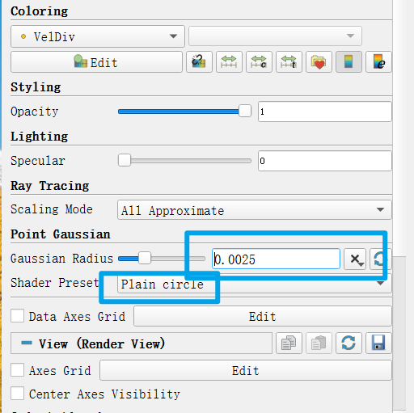

 # Paraview 保存高分辨率图片

本文用于解决以下问题
- **采用Paraview进行SPH模拟后处理，保存高分辨率流场图片**
- 对于OpenFOAM结果，保存图片方式相同

本文不适用于以下情景
- 对图片分辨率没要求，或者导出数据采用其他软件后处理

对于流场图，通常我们无法不将其保存成矢量图，但是又不想损失太多画质；起初我的方法是直接采用一些截图工具截图，发现放大后是全损画质，
后来将数据输出，采用matlab一帧帧画，费事并且matlab三维可视化局限还是太大了，**如果一定要存成矢量图格式可以采用这种方法**

Paraview是非常强大的可视化工具，直接采用Paraview保存图片也能获得比较高分辨率图片，其实原理和matlab画没啥区别，具体地流程：
- （1）导入粒子后选择 *Point Gaussian*，并在左侧属性栏里**设置粒子显示尺寸（通常等于0.5dp或者更大）和 显示格式** ，网格法后处理跳过这一步，

